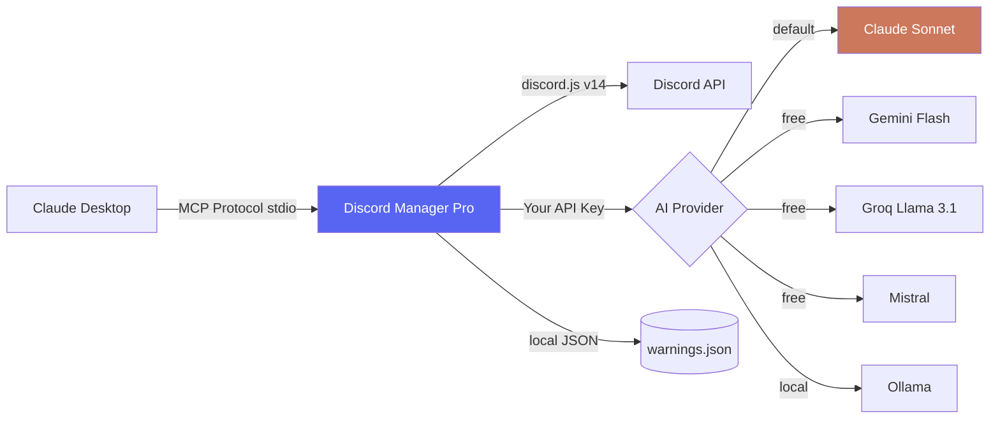

# 🤖 Discord Manager Pro

> **Turn Claude into your AI Community Operator — 88 tools, 6 AI providers, zero config dashboard**

[](LICENSE)
[](https://modelcontextprotocol.io)
[](https://discord.js.org)
[](https://www.typescriptlang.org)
[](CHANGELOG.md)
[](https://nodejs.org)

Discord Manager Pro is an open-source **Model Context Protocol (MCP) server** that gives Claude AI direct, intelligent access to your Discord server. Manage channels, members, roles, threads, webhooks, events — and get AI-powered community intelligence — all through natural conversation with Claude.

**Supports 6 AI providers. Most are completely free.**

> ⚠️ **AI Advisory:** AI analysis tools (toxicity detection, moderation suggestions, raid detection) are **advisory only**. Always apply human judgment before taking moderation actions. Do not rely solely on AI output for bans, kicks, or other consequential decisions.

---

## ✨ What Can It Do?

Just talk to Claude naturally:

```
You:    "Summarize what my community talked about today"
Claude: "Today's activity in #general covered 3 main topics: the new game patch,
         weekend tournament planning, and feedback on the recent rule changes.
         Most active: Alex, Jordan, Sam. Activity level: high."
```

```
You:    "How is my community feeling?"
Claude: "Sentiment: 68% positive, 12% negative, 20% neutral.
         Mood: Excited. No concerning patterns detected."
```

```
You:    "Scan #general for rule violations"
Claude: "Found 2 flagged messages:
         — @xyz (HIGH): Harassment → Recommend: timeout
         — @abc (LOW): Spam links → Recommend: warn"
```

```
You:    "Build me a gaming server template — show me the plan first"
Claude: "Here's the plan (dry run, nothing created yet):
         Categories: 📢 INFO, 🎮 GAMING, 💬 COMMUNITY, 🔧 STAFF
         Channels: rules, announcements, general, game-discussion...
         Roles: Admin, Moderator, Member, Bot
         Reply 'confirm' to create it."
```

---

## 🏗️ Architecture



---

## 🛠️ All 88 Tools

### Core Discord Tools (no AI key needed)

| Category | Tools |
|---|---|
| **Server** | `get_server_info`, `get_audit_log` |
| **Channels** | `list_channels`, `send_message`, `read_messages`, `delete_message`, `pin_message`, `create_channel`, `delete_channel`, `edit_channel`, `create_category`, `clone_channel`, `set_channel_topic`, `set_slowmode`, `lock_channel`, `unlock_channel`, `set_channel_permissions` |
| **Members** | `list_members`, `get_member_info`, `kick_member`*, `ban_member`*, `timeout_member` |
| **Roles** | `list_roles`, `assign_role`, `remove_role`, `create_role`, `delete_role`*, `edit_role`, `set_role_permissions`, `reorder_roles` |
| **Moderation** | `bulk_delete_messages`*, `search_messages`, `warn_member`, `get_warn_history`, `clear_warnings`, `unban_member`, `list_bans`, `add_reaction`, `remove_all_reactions`, `move_member` |
| **Threads** | `create_thread`, `list_threads`, `archive_thread`, `unarchive_thread`, `lock_thread`, `add_member_to_thread`, `delete_thread`* |
| **Webhooks** | `create_webhook`, `list_webhooks`, `delete_webhook`*, `send_webhook_message`, `edit_webhook` |
| **Events** | `create_event`, `list_events`, `delete_event`*, `edit_event`, `get_event_attendees` |
| **Analytics** | `get_member_growth`, `find_inactive_members`, `find_top_members`, `get_invite_stats`, `list_invites`, `create_invite`, `delete_invite`* |
| **Security** | `list_recent_joins`, `check_new_accounts`, `list_bots`, `disable_invites`*, `export_audit_log` |
| **Emojis** | `list_emojis`, `delete_emoji`*, `list_stickers`, `delete_sticker`* |

> \* Destructive tools — disabled by default (`SAFE_MODE=true`). Set `SAFE_MODE=false` to enable.

### AI Intelligence Tools (require AI provider key)

| Tool | What It Does |
|---|---|
| `summarize_activity` | Topics, active users, highlights, activity level |
| `analyze_sentiment` | Mood %, emotions, concern detection |
| `detect_toxicity` | Flags violations with severity + suggested actions |
| `build_server_template` | AI designs full server: categories, channels, roles. Supports `dryRun=true` for safe preview. |
| `generate_server_rules` | Writes full rule set for any community type |
| `suggest_channels` | Recommends ideal channel structure |
| `write_announcement` | Drafts professional announcements |
| `find_mod_candidates` | Identifies members ready for moderation roles |
| `weekly_digest` | Comprehensive community health report |
| `server_health_score` | Grades your server across 4 dimensions |
| `detect_raid` | AI-powered raid pattern analysis |
| `onboard_member` | Personalized welcome messages |
| `crisis_summary` | Incident analysis with action plan |
| `draft_ban_appeal_response` | Fair appeal review assistance |
| `suggest_rules_update` | Rule gap analysis based on recent activity |

---

## 🛡️ Safety Features

| Feature | Description |
|---|---|
| **SAFE_MODE** | Destructive tools disabled by default. Set `SAFE_MODE=false` to enable. |
| **Rate limiting** | Max 5 destructive actions per minute per server |
| **Permission pre-check** | Bot permissions verified before every action |
| **Role hierarchy guard** | Cannot modify roles above the bot's own role |
| **Prompt injection filter** | User content sanitized before AI injection |
| **Concurrency limiter** | Max 2 simultaneous AI calls (prevents provider rate limits) |
| **Input length cap** | All user-supplied AI inputs capped at 4000 chars |
| **Member fetch cap** | Max 1000 members fetched (protects large servers) |
| **Token redaction** | Secrets + webhook URLs never appear in logs |
| **30s tool timeout** | Hanging API calls cancelled automatically |
| **Unhandled rejection handler** | Process crashes caught and logged |

---

## 🚀 Quick Start

### Option A — Browser Dashboard (Recommended)

```bash
git clone https://github.com/meek72vibe/discord-manager-pro
cd discord-manager-pro
npm install
npm run setup
```

Your browser opens automatically. Paste your keys, pick your AI provider, click Save.

### Option B — Manual .env Setup

```bash
git clone https://github.com/meek72vibe/discord-manager-pro
cd discord-manager-pro
npm install
cp .env.example .env
# Edit .env with your values
npm run build
```

---

## ⚙️ Connect to Claude Desktop

**Mac:** `~/Library/Application Support/Claude/claude_desktop_config.json`  
**Windows:** `%APPDATA%\Claude\claude_desktop_config.json`

```json
{
  "mcpServers": {
    "discord-manager-pro": {
      "command": "node",
      "args": ["/absolute/path/to/discord-manager-pro/dist/src/index.js"]
    }
  }
}
```

Restart Claude Desktop. Done.

---

## 🤖 Creating Your Discord Bot

1. Go to [discord.com/developers/applications](https://discord.com/developers/applications)
2. **New Application** → Bot tab → **Add Bot** → copy **Token**
3. Enable **Privileged Gateway Intents**: Server Members Intent + Message Content Intent
4. **OAuth2 → URL Generator** → Scopes: `bot` → Permissions: Read/Send Messages, Manage Messages, Manage Roles, Kick/Ban Members, Moderate Members, View Audit Log
5. Invite bot to your server with generated URL

> ⚠️ Place the bot's role **above** roles you want it to manage in Server Settings → Roles

---

## 🆓 Free AI Provider Keys

| Provider | Sign Up | Notes |
|---|---|---|
| **Groq** | [console.groq.com](https://console.groq.com) | 14,400 req/day free |
| **Gemini** | [aistudio.google.com](https://aistudio.google.com) | 1M tokens/min free |
| **OpenRouter** | [openrouter.ai](https://openrouter.ai) | Multiple free models |
| **Mistral** | [console.mistral.ai](https://console.mistral.ai) | 1B tokens/month free |
| **Ollama** | [ollama.ai](https://ollama.ai) | Unlimited local |

---

## ⚠️ AI Provider Quality

| Provider | Quality | Cost | Best For |
|---|---|---|---|
| 🧠 **Claude** | ⭐⭐⭐⭐⭐ | Paid | Best accuracy, nuanced moderation |
| 💎 **Gemini 1.5 Flash** | ⭐⭐⭐⭐ | **Free** | Great all-around free option |
| 🌊 **Mistral** | ⭐⭐⭐⭐ | **Free** | Good quality, EU-friendly |
| ⚡ **Groq Llama 3.1 70B** | ⭐⭐⭐ | **Free** | Fastest, decent quality |
| 🔀 **OpenRouter** | ⭐⭐⭐ | **Free** | Most flexible |
| 🏠 **Ollama (local)** | ⭐⭐ | **Free** | Privacy-focused |

---

## 📊 Performance & Limits

| Concern | Behavior |
|---|---|
| **Large servers (>10k members)** | Analytics tools warn and cap at 1,000 members |
| **AI calls** | Max 2 concurrent; 30s timeout per call |
| **Bulk operations** | Discord API limits apply (100 msg bulk delete max) |
| **Rate limits** | 5 destructive actions/min/server |
| **Tested server sizes** | Up to ~5,000 members (larger supported with caps) |

---

## 🧪 Tests

```bash
npm test          # Run all tests
npm run test:watch  # Watch mode (after Vitest setup)
npm run test:cover  # Coverage report
```

---

## 🐛 Debug Mode

```bash
DEBUG=true node dist/src/index.js
```

---

## 📋 Example Responses

### get_server_info
```json
{
  "success": true,
  "data": { "name": "My Server", "memberCount": 1247, "channelCount": 24, "boostLevel": 2 }
}
```

### Error response (all tools)
```json
{
  "success": false,
  "errors": ["Tool \"ban_member\" is a destructive action and is currently disabled. Set SAFE_MODE=false to enable."]
}
```

---

## 🗺️ Roadmap

- [x] 88 tools across 12 categories
- [x] 6 AI providers (Claude, Groq, Gemini, OpenRouter, Mistral, Ollama)
- [x] Browser setup dashboard
- [x] SAFE_MODE + rate limiting + prompt injection protection
- [x] AI concurrency limiter + 30s timeouts
- [ ] Vitest test suite with mocked Discord
- [ ] Multi-server support
- [ ] Plugin system
- [ ] Web dashboard improvements
- [x] npm package publish

---

## 🤝 Contributing

Read [CONTRIBUTING.md](CONTRIBUTING.md) and [CLAUDE.md](CLAUDE.md) before contributing.

---

## 📄 License

MIT — free to use, modify, and distribute.

---

⭐ **If this helped you, please star the repo!**

Built with ❤️ using [Claude](https://claude.ai) + [MCP](https://modelcontextprotocol.io) + [discord.js](https://discord.js.org)
