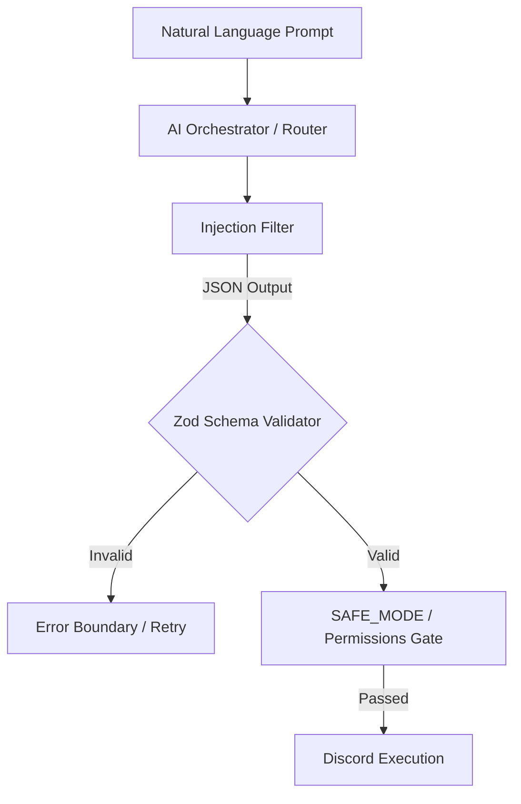

# Sentinel v5


**AI-Native Discord Infrastructure Framework**

> A deterministic, schema-enforced, security-hardened framework for managing Discord servers at scale.

---

## What Sentinel Is

Sentinel is **not a bot**. It is a **Discord infrastructure framework** that exposes a structured, validated, permission-enforced API for Discord server management — powered by Claude, Groq, Gemini, or any OpenAI-compatible provider.

### How it Works (Execution Flow)

Every action flows through a strict, zero-hallucination pipeline:



**Example Tool AI Call Flow:**
A user says: *"Silence everyone in #general for 10 seconds."*
Sentinel parses it into executing this JSON array natively:
```json
[
  {
    "tool": "set_slowmode",
    "params": {
      "channelId": "1234567890",
      "seconds": 10
    }
  }
]
```

**Nothing bypasses the wrapper.**

### Sentinel vs Traditional Bots 🆚
| Traditional Bots (MEE6, Dyno) | Sentinel v5 |
|-------------------------------|----------------|
| Requires strict `!commands` | Understands Natural English |
| Hardcoded responses | Dynamic context-aware AI |
| Siloed features (10 bots needed) | Unified 157-tool API |
| Manual moderation needed | Proactive Autonomy / RAG |

---

## Modes

### MCP Server (Claude Desktop / Cursor)
Connect Sentinel to Claude Desktop for a fully conversational Discord management experience. Claude can call any of Sentinel's tools — all guarded by schema validation and safety policies.

### Discord Bot
Run Sentinel as a standalone bot with regex command handling and AI fallback.

---

## Quick Start

```bash
git clone https://github.com/Meek72vibe/discord-manager-pro.git
cd discord-manager-pro
npm install
cp .env.example .env
# Edit .env with your tokens
npm run build
node dist/src/index.js
```

### Claude Desktop Config

```json
{
  "mcpServers": {
    "sentinel": {
      "command": "node",
      "args": ["/absolute/path/to/dist/src/index.js"],
      "env": {
        "DISCORD_TOKEN": "your_token",
        "DISCORD_GUILD_ID": "your_guild_id",
        "GROQ_API_KEY": "your_groq_key",
        "SAFE_MODE": "true"
      }
    }
  }
}
```

---

## Environment

| Variable | Required | Default | Description |
|----------|----------|---------|-------------|
| `DISCORD_TOKEN` | ✅ | — | Bot token |
| `DISCORD_GUILD_ID` | ✅ | — | Target guild |
| `GROQ_API_KEY` | ✅* | — | Required if AI_PROVIDER=groq |
| `AI_PROVIDER` | ❌ | `groq` | `groq` \| `gemini` \| `claude` \| `openrouter` \| `mistral` \| `ollama` |
| `SAFE_MODE` | ❌ | `true` | Block destructive tools |
| `READ_ONLY` | ❌ | `false` | Block all mutations |
| `DEBUG_MODE` | ❌ | `false` | Verbose structured logs |

---

## Architecture Guarantees

1. **Zero Hallucination Actions:** The Zod pipeline mathematically prevents the AI from calling a tool with missing or correctly-typed arguments.
2. **Deterministic Role Hierarchy:** Even if the AI orders a kick, the Discord API role hierarchy constraint supersedes it natively.
3. **Audit Immutability:** All destructive actions executed by the agent are appended to a structured JSONL audit trail, regardless of the logging verbosity level.

---

## Safety & SAFE_MODE

Because Sentinel grants an AI administrative access, safety is physically hardcoded into the pipeline wrapper.

| Mode | Effect |
|------|--------|
| `SAFE_MODE=true` (default) | All destructive tools (kick, ban, delete, etc.) are blocked at the wrapper. Even if the AI tries to ban someone, the API rejects it before touching Discord. |
| `READ_ONLY=true` | All mutations are blocked — analysis and read operations only. |
| `DEBUG_MODE=true` | Verbose structured JSON logs to stderr. |

Furthermore, the **Role Hierarchy Check** dynamically calculates Discord permissions. It is impossible for Sentinel to execute a tool (like `timeout`) against a user who outranks the bot in the Discord Role list.

Read → [SECURITY.md](./SECURITY.md) for the full threat model.

---

## Tools

Sentinel ships with **157 robust tools** across 5 categories:

| Category | Tools |
|----------|-------|
| 🛡 **Moderation (15 Tools)** | kick, mass_kick, ban, mass_ban, unban, softban, timeout, remove_timeout, warn, list_warnings, clear_warnings, purge_messages, verify_member, quarantine, unquarantine |
| 🏗 **Structure (32 Tools)** | create/edit/delete/clone channels (text, voice, forums, stages), edit categories, manage roles/permissions, create/manage threads, webhooks, server events |
| 📊 **Analytics (17 Tools)** | member growth, invite tracking, inactive member detection, new account flagging, active voice checks, raid detection, full server audit logs |
| 🛠 **Utility (27 Tools)** | read/send/search/delete/pin messages, dm users, emoji/sticker management, create polls, math, dice rolls, coin flips, server info, bot latency/uptime status |
| 🤖 **AI Operations (19 Tools)** | natural language router, channel summarization, sentiment analysis, toxicity scanning, churn prediction, server lore generator, rules generator, topic drift detection |

---

## Architecture

```
src/
├── index.ts                    ← MCP server entry point
├── config/
│   ├── limits.ts               ← All hard limits (no magic numbers)
│   └── safety.ts               ← SAFE_MODE, READ_ONLY, DESTRUCTIVE_TOOLS
├── core/
│   ├── executeTool.ts          ← THE single execution wrapper
│   ├── toolRegistry.ts         ← Tool registration + plugin API
│   ├── validateAction.ts       ← Zod schema validation
│   ├── rateLimiter.ts          ← Per-guild rate limiting
│   ├── aiOrchestrator.ts       ← Concurrency + timeout + retry + providers
│   └── injectionFilter.ts      ← Prompt injection detection
├── adapter/
│   └── discordAdapter.ts       ← Discord client + permission helpers
├── logging/
│   └── logger.ts               ← Structured JSON logging + redaction
├── tools/
│   ├── moderation/             ← Moderation tools
│   ├── structure/              ← Channel/role/thread/webhook/event tools
│   ├── analytics/              ← Analytics and security tools
│   ├── utility/                ← Utility and message tools
│   └── ai/                     ← AI-powered analysis tools
├── types/
│   └── action.ts               ← ToolDefinition, ToolResult, ToolContext
└── db/
    └── warnings.ts             ← In-memory warning store
```

---

## Versioning Policy

Sentinel strictly adheres to [Semantic Versioning](https://semver.org/):
- **MAJOR (vX.0.0):** Breaking changes to the ToolDefinition API, schema structure, or core safety defaults.
- **MINOR (v1.X.0):** Adding new non-breaking categories, tools, or AI models.
- **PATCH (v1.0.X):** Bug fixes, prompt tweaks, and documentation updates.

---

## Production Deployment & Docker

For enterprise scale, we recommend PM2 or Docker.

### PM2
```bash
npm run build
pm2 start ecosystem.config.cjs
pm2 save
```

### Docker
```bash
docker build -t sentinel-v5 .
docker run -d --name sentinel \
  --env-file .env \
  -v $(pwd)/audit_trail.jsonl:/usr/src/app/audit_trail.jsonl \
  sentinel-v5
```

---

## Performance Benchmarks ⚡

On average, the wrapper introduces **< 5ms overhead** per tool call. The primary bottleneck is the LLM inference speed.

| Operation | Latency (avg) | Notes |
|-----------|----------------|-------|
| Zod Schema Validation | ~0.5ms | Full object parsing |
| Permission Gate Check | ~0.2ms | Cached bitwise operation |
| Discord API Mutation | 50-100ms | REST API Roundtrip |
| DeepSeek / Groq AI | ~0.8s - 1.2s | LLM Generation (Fast) |
| Claude 3.5 Sonnet | ~2s - 4s | LLM Generation (Quality) |

For massive operations (like `mass_ban`), Sentinel batches requests to respect Discord's rate limits (`429 Too Many Requests`).

---

## Plugin System

Register third-party tools with the same API:

```typescript
import { registerTool } from "./src/core/toolRegistry.js";
import { z } from "zod";

registerTool({
  name: "my_custom_tool",
  description: "Does something useful",
  schema: z.object({ input: z.string() }),
  destructive: false,
  requiredPermissions: [],
  async handler(ctx, { input }) {
    return { success: true, data: { processed: input } };
  },
});
```

---

## Performance

See [PERFORMANCE.md](./PERFORMANCE.md) for benchmarks, limits, and large-guild recommendations.

---

## Versioning

- **v5.0.0** — Infrastructure freeze. Core pipeline is stable.
- Breaking changes to the `ToolDefinition` interface will bump the major version.
- New tools added in minor versions.

---

## License

MIT
